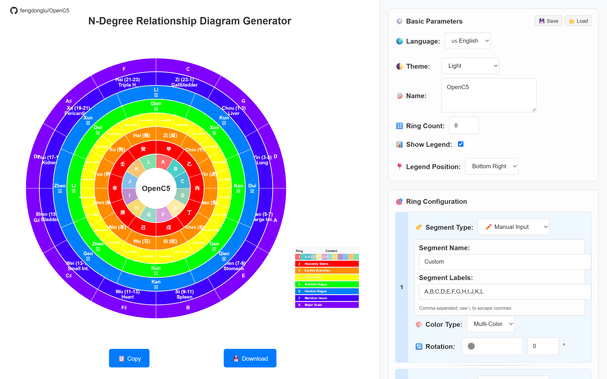
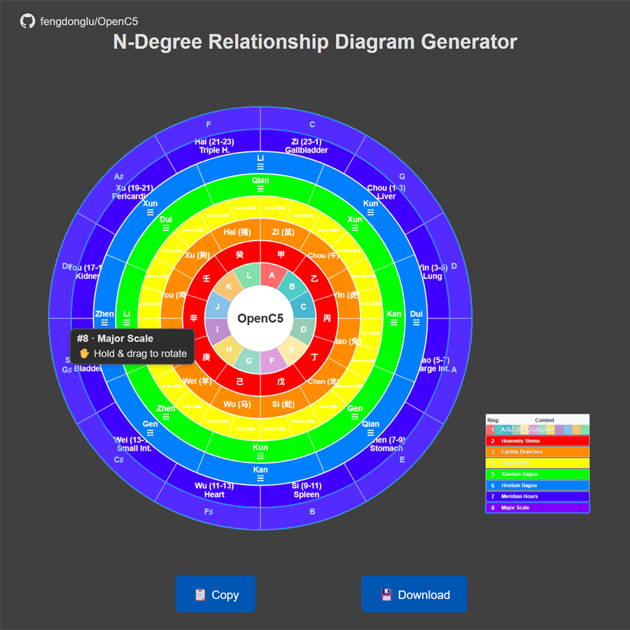

# OpenC5 — N-Degree Relationship Diagram Generator

A **single-file**, **zero-dependency** web app that generalizes the classic "circle of fifths" into a configurable N-degree ring diagram generator.




---

## 🎯 Introduction

OpenC5 starts from the classic "circle of fifths" concept and generalizes it into a general-purpose N-degree ring relationship diagram tool. Rather than locking you in a single music-theory layout, it lets you build concentric rings, decide what each ring is divided into, and rotate every ring independently. It suits music theory, traditional culture, astronomy, and any other cyclic or relationship-based visualization.

## ⚙️ Features

- **Multi-ring layout**: **1–99** concentric rings, validated on input. Each ring is configured independently.
- **11 preset segment types**: Manual Input, Heavenly Stems, Earthly Branches, 24 Solar Terms, Xiantian Bagua, Houtian Bagua, Meridian Hours, Major Scale, Minor Scale, Zodiac, and Chinese Zodiac.
- **Two display modes per ring**: solid color or multi-colored segments; the display mode is **independent** of the segment type.
- **Per-ring configuration**: segment type, color type, color, rotation angle, and segment labels.
- **Interactive rotation**: drag a ring directly in the preview to rotate it — text stays **upright** while dragging and does not tilt with the ring. Each ring also has an angle slider (**0–360**) and a numeric input.
- **Hover feedback**: hovering a ring highlights it with an emphasis overlay (`fill-opacity` **0.35**) and shows a tooltip that follows the cursor. The tooltip has two lines: the first shows `#N · content`, the second a **hold and drag to rotate** hint that is **internationalized** to follow the selected language.
  
- **Legend**: a visibility toggle with position options (**right / bottom-right**, default **bottom-right**). Rows are colored per ring — a whole row takes the ring color for solid rings, and multi-colored rings show segmented color swatches. Text is white with an outline. Hovering a ring highlights the matching legend row.
- **Configuration management**: export the configuration to JSON and import it back; a toast ("Configuration loaded successfully!") confirms a successful import.
- **Export**: copy the SVG source to the clipboard (with an alert on success or failure) or download a file named `multi-ring-circle.svg`. **SVG only** — there is no PNG or PDF export.
- **Internationalization**: Chinese / English interface; interface text and the tooltip hint switch with the language. Switching the language also updates `<html lang>` and resets each ring's segment labels for the selected language.
- **Themes**: light / dark / follow system, default **light**. An inline script reads the saved theme before the first paint to avoid a flash of unstyled content (**no FOUC**).
- **Responsive layout and mobile touch**: touch dragging and touch-friendly controls.
- **Theme persistence**: only the theme preference is stored in `localStorage` (key `selectedTheme`); other settings travel through JSON export / import.
- **Adaptive label sizing**: ring label font size adapts to the arc length / ring thickness and is clamped to a readable range.
- **Layout details**: parameter cards use a left vertical numbering column (numbers upright and centered), and the basic-parameters header embeds compact Save / Load buttons.
- **Center text**: supports multiple lines and multilingual storage.
- **Lightweight preview**: dragging and the slider use a transform-only lightweight preview instead of the whole diagram being rebuilt, with a single full redraw on release.

## 🔗 Live Demo

https://fengdonglu.github.io/OpenC5/

> **Note:** GitHub Pages is not yet published / enabled; the demo will be available once it is enabled.

## 🚀 Quick Start

Open `index.html` directly in a modern browser, or serve the folder over HTTP:

```bash
python -m http.server 8000
```

Alternative with `npx`:

```bash
npx serve .
```

Then visit `http://localhost:8000/`.

> **Tip:** You can also just open `index.html` directly — no server required.

## 🧭 Usage

### Basic parameters

Set the number of rings (**1–99**) and choose the display mode (solid color or multi-colored segments). Each ring is configured independently. The basic-parameters header contains compact Save / Load buttons for configuration files.

### Ring configuration

For every ring you can pick a preset segment type, edit the segment labels, choose a color type and color, and set the rotation angle.

### Preset segment types

Use one of the **11** built-in preset segment types (see the table below) or enter a fully custom list of segments.

| # | Preset segment type |
| --- | --- |
| 1 | Manual Input |
| 2 | Heavenly Stems |
| 3 | Earthly Branches |
| 4 | 24 Solar Terms |
| 5 | Xiantian Bagua |
| 6 | Houtian Bagua |
| 7 | Meridian Hours |
| 8 | Major Scale (circle of fifths) |
| 9 | Minor Scale |
| 10 | Zodiac |
| 11 | Chinese Zodiac |

### Rotation

Rotate a ring by dragging it directly in the preview, or with the per-ring angle slider (**0–360**) and numeric input. A real exported sample is available at `examples/sample-export-zodiac.svg`.

### Export

Copy the generated SVG source to the clipboard, or download it as an `.svg` file named `multi-ring-circle.svg`.

### Configuration import / export

Save the full configuration as JSON and import it back later to restore a diagram. A toast is shown after a successful import.

## 🏗️ Architecture

OpenC5 is a single-file application: all HTML, CSS, and JavaScript live inline in `index.html`, with **zero dependencies** and no build step. The JavaScript is plain vanilla JavaScript organized as object-literal modules — for example `InternationalizationManager`, `SegmentData`, `SVGUtils`, `SVGShapes`, `SVGText`, `RingRenderer`, `Legend`, `CenterText`, `ConfigurationManager`, and `ThemeManager`. There is no framework (no Vue), no class hierarchy, and no bundler. The diagram is rendered directly to SVG, and only the theme preference is persisted in `localStorage`.

## 🗂️ Project Structure

```text
OpenC5/
├── index.html            # single-file app (HTML + CSS + JS inline)
├── README.md             # English documentation
├── README.zh-CN.md       # Chinese documentation
├── LICENSE               # MIT
├── assets/
│   ├── hero.png          # English UI screenshot
│   └── hero.zh-CN.png    # Chinese UI screenshot
├── examples/
│   └── sample-export-zodiac.svg
├── tests/
│   ├── repo-link.test.mjs
│   ├── layout.test.mjs
│   └── regression.test.mjs
└── .gitignore
```

## 🌐 Browser Compatibility

OpenC5 targets modern evergreen browsers (recent Chrome, Edge, Firefox, and Safari). It relies on standard SVG rendering, `localStorage`, the Clipboard API, and `prefers-color-scheme` for the **follow system** theme. Exact behavior may vary in older browsers that do not support these features.

## 🧪 Testing

The repository ships three `.mjs` tests that run on Node's built-in capabilities. Run them from the repository root:

```bash
node tests/repo-link.test.mjs
node tests/layout.test.mjs
node tests/regression.test.mjs
```

## 🗺️ RoadMap

> **Note:** The following items are **planned features, not yet implemented**:

- Dedicated music circle-of-fifths mode: start key / direction / start angle, number of accidentals, enharmonic spelling (F♯/G♭), note-name systems (English / German H-B / Chinese), relative major–minor links, ii–V–I progression paths, and fourth-cycle arrows.
- General N-node ring mode: configurable step k, node grouping colors, and directed / undirected / weighted edges.
- PNG / PDF export via offscreen Canvas rendering.
- Preset management UI: rename / delete / import / export.
- Accessibility improvements: full ARIA, keyboard navigation, and screen-reader descriptions.
- Plugin system and PWA offline mode.
- More presets (planets, elements, etc.).

---

## 📄 License

MIT © 2025 fengdonglu. See [LICENSE](LICENSE).

## ✨ Vibe Coding

> This project was built through Vibe Coding — the author did not hand-write any code. The entire codebase was generated by AI agents driven purely by natural-language instructions.

## 🐙 Repository

Back to the repository: https://github.com/fengdonglu/OpenC5
