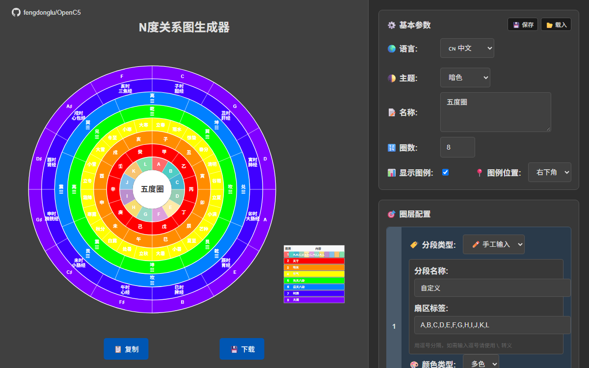
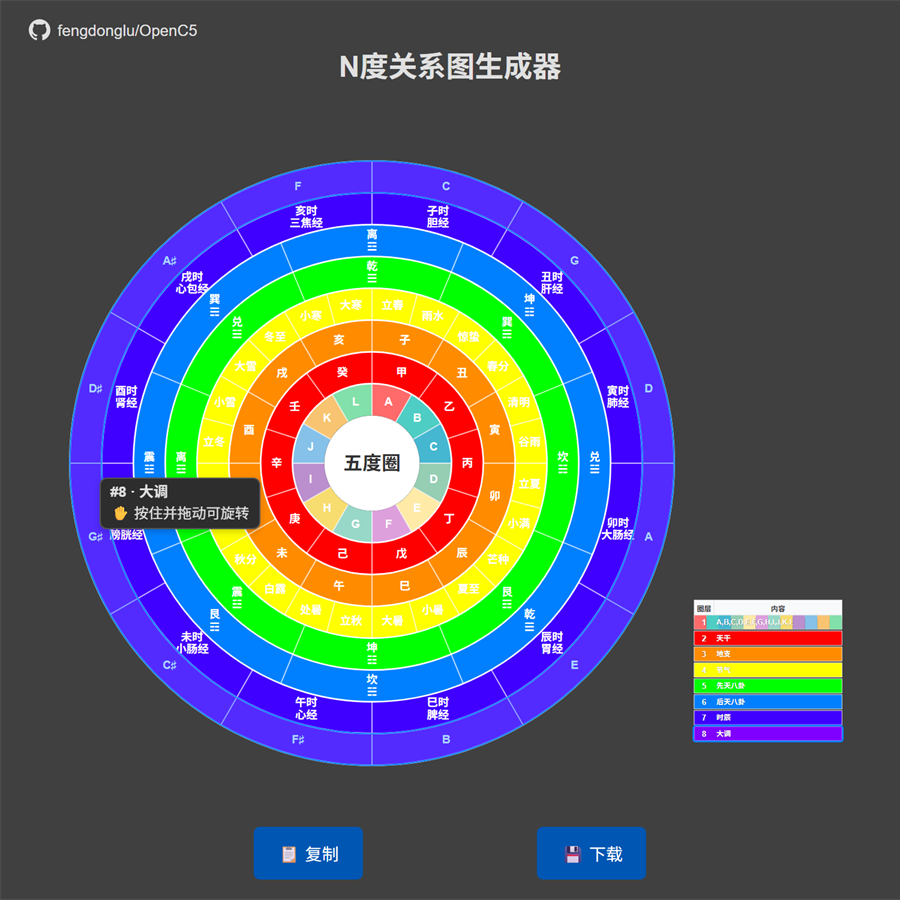

# OpenC5 — N 度关系图生成器

一个**单文件**、**零依赖**的 Web 应用，把经典的「五度圈」泛化为可配置的 N 度环形关系图生成器。




## 简介

OpenC5 从经典的「五度圈」概念出发，将其泛化为通用的 N 度环形关系图工具。它不再局限于单一的音乐理论布局，而是让你自由构建多层同心圆环、自行决定每个环的分段内容，并独立旋转每一个环。它适用于音乐理论、传统文化、天文学，以及其它循环或关系型可视化场景。

## 功能特性

- **多圈层布局**：**1–99** 个同心圆环（输入时校验），每个环独立配置。
- **11 种预设分段类型**：手工输入、天干、地支、二十四节气、先天八卦、后天八卦、子午流注 / 经络时辰、音乐大调（五度圈）、音乐小调、十二星座、十二生肖。
- **每个圈层两种显示模式**：纯色或多色分段；显示模式与分段类型**相互独立**。
- **每环独立配置**：分段类型、颜色类型、颜色、旋转角度、分段标签。
- **交互式旋转**：在预览区直接拖拽圈层旋转——拖动时文字保持**正立**，不会随圈倾斜。每环还提供角度滑块（**0–360**）与数值输入。
- **悬停反馈**：鼠标悬停某圈层时，以强调色覆盖层（`fill-opacity` **0.35**）高亮该圈层，并显示一个跟随鼠标的提示浮标。浮标共两行：第一行显示 `#N · 内容`，第二行是**按住并拖动可旋转**提示，该提示已**国际化**，随所选语言切换。
  
- **图例**：显示开关，位置可选「**右侧 / 右下角**」（默认**右下角**）。图例行按圈层颜色着色——纯色圈整行取圈层颜色，多色圈按分段显示色块；文字为白色带描边。鼠标悬停某圈层时，对应图例行高亮。
- **配置管理**：导出配置到 JSON，并可导入还原；导入成功后以 toast 提示（「配置载入成功！」）。
- **导出**：复制 SVG 源码到剪贴板（成功或失败以 alert 提示），或下载名为 `multi-ring-circle.svg` 的文件。**仅支持 SVG**，无 PNG / PDF 导出。
- **国际化**：中 / 英双语界面；界面文字与浮标提示随语言切换。切换语言时还会同步更新 `<html lang>`，并按语言重设各圈分段标签。
- **主题**：浅色 / 暗色 / 跟随系统，默认**浅色**。首帧渲染前由一段内联脚本读取已保存主题，避免闪烁（**无 FOUC**）。
- **响应式布局与移动端触摸**：支持触摸拖拽与触摸友好控件。
- **主题持久化**：仅主题偏好写入 `localStorage`（键 `selectedTheme`），其余配置通过 JSON 导出 / 导入传递。
- **标签字号自适应**：圈层标签字号随弧长 / 环厚自适应，并钳制在可读区间。
- **布局细节**：参数卡片采用左侧竖排编号列（数字正立居中），基本参数标题行内嵌紧凑的 Save / Load 小按钮。
- **中心文字**：支持多行、多语言存储。
- **轻量预览**：拖拽与滑块使用仅 transform 的轻量预览，不整图重建，松手后统一重绘一次。

## 在线演示

https://fengdonglu.github.io/OpenC5/

> GitHub Pages 尚未发布 / 启用，发布后生效。

## 快速开始

直接在浏览器中打开 `index.html`，或用本地 HTTP 服务器托管该目录：

```bash
python -m http.server 8000
```

也可使用 `npx` 作为备选：

```bash
npx serve .
```

然后访问 `http://localhost:8000/`。

## 使用说明

### 基本参数

设置圈层数量（**1–99**），选择显示模式（纯色或多色分段）。每个圈层独立配置。基本参数标题行内嵌紧凑的 Save / Load 按钮，用于存取配置文件。

### 圈层配置

为每个环选择预设分段类型、编辑分段标签、选择颜色类型与颜色，并设置旋转角度。

### 预设分段类型

使用 **11** 种内置预设分段类型之一（见下表），或输入完全自定义的分段列表。

| 编号 | 预设分段类型 |
| --- | --- |
| 1 | 手工输入 |
| 2 | 天干 |
| 3 | 地支 |
| 4 | 二十四节气 |
| 5 | 先天八卦 |
| 6 | 后天八卦 |
| 7 | 子午流注 / 经络时辰 |
| 8 | 音乐大调（五度圈） |
| 9 | 音乐小调 |
| 10 | 十二星座 |
| 11 | 十二生肖 |

### 旋转

在预览区直接拖拽圈层进行旋转，或使用每环的角度滑块（**0–360**）与数值输入。真实导出样张见 `examples/sample-export-zodiac.svg`。

### 导出

将生成的 SVG 源码复制到剪贴板，或下载为名为 `multi-ring-circle.svg` 的 `.svg` 文件。

### 配置导入 / 导出

把完整配置保存为 JSON，之后可导入以还原图表。导入成功后会显示 toast 提示。

## 架构

OpenC5 是单文件应用：全部 HTML、CSS 与 JavaScript 都内联在 `index.html`，**零依赖**、无构建步骤。JavaScript 采用原生 JavaScript，以普通对象字面量模块组织——例如 `InternationalizationManager`、`SegmentData`、`SVGUtils`、`SVGShapes`、`SVGText`、`RingRenderer`、`Legend`、`CenterText`、`ConfigurationManager`、`ThemeManager`。没有框架（无 Vue）、没有类继承、没有打包器。图形直接渲染为 SVG，且仅主题偏好持久化到 `localStorage`。

## 项目结构

```text
OpenC5/
├── index.html            # 单文件应用（HTML + CSS + JS 内联）
├── README.md             # 英文文档
├── README.zh-CN.md       # 中文文档
├── LICENSE               # MIT
├── assets/
│   ├── hero.png          # 英文界面截图
│   └── hero.zh-CN.png    # 中文界面截图
├── examples/
│   └── sample-export-zodiac.svg
├── tests/
│   ├── repo-link.test.mjs
│   ├── layout.test.mjs
│   └── regression.test.mjs
└── .gitignore
```

## 浏览器兼容

OpenC5 面向现代常青浏览器（较新的 Chrome、Edge、Firefox、Safari）。它依赖标准 SVG 渲染、`localStorage`、Clipboard API，以及用于**跟随系统**主题的 `prefers-color-scheme`。在不支持这些特性的旧浏览器中，具体表现可能存在差异。

## 测试

仓库自带三个基于 Node 内置能力的 `.mjs` 测试。请在仓库根目录运行：

```bash
node tests/repo-link.test.mjs
node tests/layout.test.mjs
node tests/regression.test.mjs
```

## RoadMap

以下均为计划中、**尚未实现**的功能：

- 音乐五度圈专用模式：起始调 / 方向 / 起始角度、调号数量、等音异名（F♯/G♭）、音名体系（英美 / 德式 H-B / 中文）、相对大小调连线、ii–V–I 进行路径、四度循环箭头。
- 通用 N 节点环形模式：可配置步长 k、节点分组配色、有向 / 无向 / 加权连边。
- PNG / PDF 导出（离屏 Canvas 渲染）。
- 预设管理界面：重命名 / 删除 / 导入导出。
- 无障碍完善：完整 ARIA、键盘导航、屏幕阅读器描述。
- 插件系统与 PWA 离线模式。
- 更多预设（行星、元素等）。

## 许可证

MIT © 2025 fengdonglu。详见 [LICENSE](LICENSE)。

## Vibe Coding 说明

> 本项目基于 Vibe Coding 构建：作者未手工输入任何代码，全部代码均由自然语言驱动的智能体生成。

## 仓库

返回仓库：https://github.com/fengdonglu/OpenC5
